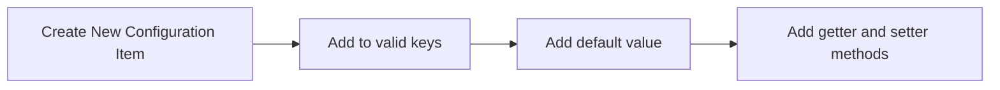

#Topic/PUtilities #Topic/Programming 
# PUtilities Documentation

## Introduction

PUtilities is a versatile utilities suite built in python. It utilises object-oriented programming to efficiently create tabs inheritting from the in-buit object TabFrame. All major functions used in the development of new tabs have sufficient docstrings to explain their purpose, arguments, etc.

## The Basics

To start your development of a PUtilities tab, create a **new file** under PUtilities/classes. The name of this file should be in **PascalCase** and end with .py to indicate it is a python file (example: MyExampleTab.py). Once in the new python file, the following boilerplate (necessary) code **MUST BE ADDED**:

```python
from classes.Utilities import * # Import everything from the Utilities module, including TabFrame.

class MyExampleTab(TabFrame): # Replace this with the name of your file.
    def init(self): # Method that runs when the tab is created.
        self.tabname = "My Example Tab" # Sets the name of the tab and automatically updates it.
```

The first line of the file is responsible for **importing Utilities**. Make sure to reference it as classes.Utilities to ensure it imports properly, due to some weird properties of python. The * symbol represents importing everything from the module, so you do not need to referene it as Utilities, instead it acts as if all the functions were defined in the current file.

The next line of code **defines the class** of your tab. Using the class keyword, type the name of your tab in PascalCase, the same as your filename, and follow it with **(TabFrame):**. This means that it **inherits** (gets all) methods from the TabFrame class, meaning that it can be added to the **Window** as a tab.

The method **init()**, from the **TabFrame** class, is responsible for creating everything in the tab. It must be defined in order to add anything to the tab, and runs when the tab is first opened. It can be seen as the **most important method** within the TabFrame class.
The line 'self.tabname = "My Example Tab' is responsible for setting the tabs name. The tabname component is called a property, and it acts as if it were a variable, except when setting it or referencing it it calls different methods.

All **methods** in the class are stored one indent in. Lots of other methods come with the TabFrame class which **do not necessary need to be defined**, as when inheriting your class already has all these methods. You can also define your own **custom methods** within the tab, which could be responsible for anything from changing the name of a button to inserting some text into a field to copying the data to a dictionary. Some **useful** in-built TabFrame commands that you can define include:

- **createTabCommands()**: Used to **create any tab commands** using their respective methods. Is called **automatically** after the init() method of the tabframe is run, so you do not need to call it manually. Use **addTabFunction()**, **addTabCheckbox()**, and **addExportCommand** to add the tab commands from this method.

- **save()**: Called using the keyboard shortcut Control+s or when clicking save in the menu. Used to save the file if the filepath is already known.

- **saveAs()**: Called using the keyboard shortcut Control+Shift+s or when clicking save as in the menu. Used to save the file with a new filename.

- **open()**: Called using the keyboard shortcut Control+o, or when clicking open in the menu. Used to open a file, and usually saves the current file you are working on at the moment.

- **new()**: Called using the keyboard shortcut Control+n, or when clicking new in the menu. Used to create a new file, and usually save the current file you are working on at the moment.

- **close()**: Called using the keyboard shortcut Control+w, or when clicking close current tab in the menu. Closes the current tab.

An example of a **more complex tab** can be shown below:

```python
from classes.Utilities import *

class MyExampleComplexTab(TabFrame):
    def init(self):
        self.tabname = "My Example Complex Tab"
        self.textbox = ScrollableTextBox(self)
        self.textbox.pack(expand=1, fill="both")
        self.filepath = None

    def createTabCommands(self):
        self.addTabFunction("Insert Date", lambda: self.textbox.insertAtEnd(datetime.datetime.now().strftime("%d/%m/%Y")))
        self.addTabFunction("Clear Text", self.textbox.clear)

    def save(self) -> None:
        if not self.filepath:
            self.saveAs()
            return
        with open(self.filepath, "w") as f:
            f.write(self.textbox.getAll())

    def saveAs(self):
        if self.filepath:
            self.save()
        savepath = filedialog.asksaveasfilename(title="Save Text File", defaultextension=".txt", filetypes=[("Text Document", ("*.txt")), ("All Files", ("*.*"))])
        if not savepath or not os.path.exists(filepath(savepath)):
            return
        self.filepath = savepath
        self.tabname = filename(savepath)
        self.save()

    def open(self) -> None:
        if self.filepath:
            self.save()
        loadpath = filedialog.askopenfilename(title="Open Text Document", filetypes=[("Text Document", "*.txt"), ("All Files", "*.*")])
        if not loadpath:
            return
        self.filepath = loadpath
        with open(self.filepath, "r") as f:
            self.textbox.clear()
            self.textbox.insertAtStart(f.read())

    def new(self):
        if self.filepath:
            self.save()
        self.textbox.clear()
        self.filepath = None
```

In this example (based off the text editor), a **filepath** is defined in the init() method. By default, the filepath is set to None. A **ScrollableTextBox** (from the Utilities module) is then placed in the tab using the **pack()** method. The tabname is also set. Then, the method **createTabCommands()** is defined, and two commands are created, one which clears the textbox, and the other which inserts the date at the end of the textbox. These are defined using the **addTabFunction()** method. Then, the **save()** method is defined, in which it checks for a filepath. If there is not a filepath, then it calls saveAs and returns (exits the function). Afterwards, the **saveAs()** method is defined, in which it starts by saving if a filepath is detected, before asking the user where they would like to save the new file using the **filedialog.asksaveasfilename()** method. If there is not a filepath selected, then the function is exited. Otherwise, the text from the textbox is written to the filepath. The **open()** method opens a file by first saving if there is a filepath, and then clearing the textbox and asking the user for the file to open using the **filedialog.askopenfilename()** function. If there is not a filepath selected, it returns, else it clears the textbox, reads the file, and inserts the file into the textbox, and sets the filepath. Finally, the **new()** method is defined, where it saves if there is a filepath, and then clears the textbox and the filepath.

## Configuration

To access PUtilities configuration, after importing everything from the Utilities module, you can simply access the variable CONFIGURATION of type ConfigGetterFactory. This will provide methods to get parts or all of the documentation. For example:

```python
from classes.Utilities import * # Must import everything to access the configuration variable.

class ConfigurationExample(TabFrame):
    def init(self) -> None:
        username = CONFIGURATION.username # Get the username from the configuration
        timetable = CONFIGURATION.timetable # Get the timetable
        full_config = CONFIGURATION.get_all() # Get the full configuraiton dictionary
        subjects = CONFIGURATION.get_key("subjects") # Get the key 'subjects' from the config
        # file. Can also use:
        subjects = CONFIGURATION.subject_list # etc.
```

To create a **new item** in configuration, you must first add the item to the valid configuration keys under the **ConfigGetterFactory** in the Utilities.py file. The list of valid keys can be found within the **\_\_init\_\_** method of this class. Then, a getter and setter method must be defined below, before finally adding the key and the default value to the list of defaults within the **reset_to_defaults()** method. An example of adding a new configuration item, *previous_save_time*, can be seen below:



```python
# In the Utilities.py file, edit ONLY what is necessary to include
# your configuration

class ConfigGetterFactory:
    def __init__(self, filepath: str) -> None:
        self.filepath = filepath
        self._manager = utils.FileFactory().create_json_file_manager(self.filepath)
        self.config = self._manager.read()
        self.valid_keys = (
        "username",
        "rounding",
        "angle_unit",
        "show_error_windows",
        "default_tab",
        "terminalprompt",
        "subjects",
        "timetable",
        "recent_files",
        "previous_save_time" # Add your key to the list of valid keys.
        )
        self.defaults = {"username": "Default User", "rounding": 3, "angle_unit": "Degrees",
            "show_error_windows": True, "default_tab": "Home Tab", "terminalprompt": "PUtilities $",
            "subjects": ["No Subject Selected"],
            "timetable": {"Monday": ["No Subject Selected", "No Subject Selected", "No Subject Selected", "No Subject Selected"],
                "Tuesday": ["No Subject Selected", "No Subject Selected", "No Subject Selected", "No Subject Selected"],
                "Wednesday": ["No Subject Selected", "No Subject Selected", "No Subject Selected", "No Subject Selected"],
                "Thursday": ["No Subject Selected", "No Subject Selected", "No Subject Selected", "No Subject Selected"],
                "Friday": ["No Subject Selected", "No Subject Selected", "No Subject Selected", "No Subject Selected"],
                "Saturday": ["No Subject (weekend)", "No Subject (weekend)", "No Subject (weekend)"],
                "Sunday": ["No Subject (weekend)", "No Subject (weekend)", "No Subject (weekend)"]},
            "recent_files": [],
            "previous_save_time": "0:00" # add the default value
        }

    @property # define the below method as a property of the class.
    def previous_save_time(self) -> str: # name the method the same as the key.
        self.update_config() # update the configuration file.
        return self.get_key("previous_save_time") # get the previous
        # save time. If not found, will reset to default value.

    @previous_save_time.setter # a setter method if you want to set the value
    def previous_save_time(self, new: str) -> None: # same name as getter method, but takes in an argument for the new value.
        self.update_config()
        self._write_value("previous_save_time", new) # write the new value
```

## More Complex Design Patterns

While PUtilities provides a good interface to create whatever you could imagine within it's tabs, a good design pattern will help improve **code readability** and make your interfaces look beautiful. For this, a number of concepts from object-oriented programming must be used, as it interfaces well with your tabs.

For example, let's say you have a tab which sorts to-do items into in-progress, not started, or completed. How would you do this? A good approach would be to create a custom data object to represent a to-do item, using something like a dataclass or a standard class. An example can be seen below:

```python
from classes.Utilities import *

class ToDoItem:
    def __init__(self, name: str, description: str,
    type_: typing.Literal["Not Started", "In Progress", "Completed"]) -> None:
        self.name = name
        self.description = description
        self.Type = type_

    def mark_not_started(self) -> None:
        self.Type = "Not Started"
    
    def mark_in_progress(self) -> None:
        self.Type = "In Progress"
    
    def mark_completed(self) -> None:
        self.Type = "Completed"


class MyExampleTab(TabFrame):
    def init(self) -> None:
        self.tabname = "My Example Tab"
        ... # More code goes here!
```